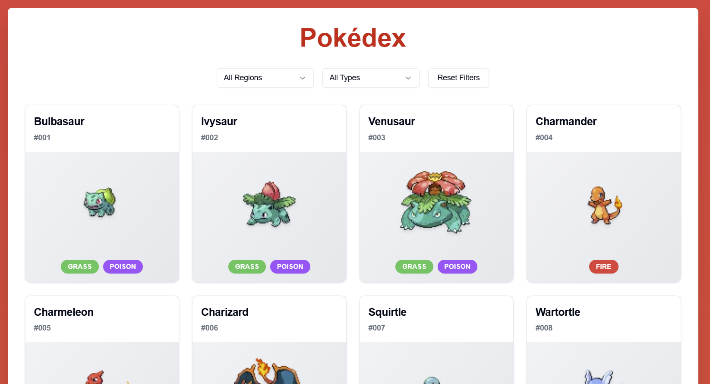

# Pokedex - Technical Test

Welcome to the **Pokedex**! This is a web application that allows you to browse and explore information about Pokémon. Built with modern web technologies, this app provides a clean and intuitive interface for Pokémon enthusiasts.



---

## Try It Out!

You can test the app directly by visiting the live demo here:  
👉 [Live Demo - Pokedex](https://pokedex-two-sand.vercel.app/) 
---

## Technologies Used

- **Frontend**: [React](https://reactjs.org/) (for the user interface), [Next.js](https://nextjs.org/) (for server-side rendering), [tailwindcss](https://tailwindcss.com/) (for styling) and [TypeScript](https://www.typescriptlang.org/) (for type checking)
- **API**: [PokéAPI](https://pokeapi.co/) (for Pokémon data)
- **Package Manager**: npm or yarn
---

## How to Install and Run the Project

Follow these steps to set up the project locally on your machine.

### Prerequisites

- [Node.js](https://nodejs.org/) (v14 or higher)
- [npm](https://www.npmjs.com/) or [yarn](https://yarnpkg.com/) (for package management)

### Installation

1. **Clone the repository**:
   ```bash
   git clone https://github.com/jorgeobnd/technical-pokedex.git
   cd technical-pokedex
  ```
  
2. **Install Dependencies**:
    ```bash
    npm install
    npx shadcn@latest add badge
    npx shadcn@latest add card
    npx shadcn@latest add button
    npx shadcn@latest add select
  ```
  
3.**Run project**
```bash
npm run dev
```